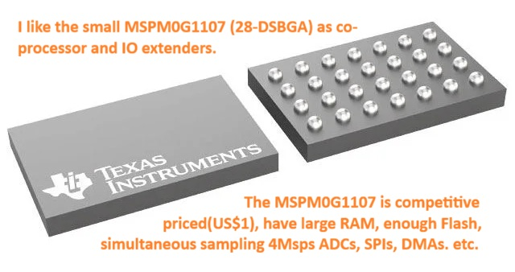

# Edge AI Condition Monitoring on TI MSPM0 Series for Real Time interpretation of motor vibrations
### 💡 High-Performance Endpoint AI for 3-Phase/BLDC Motors using Random Forest Models
**Developed by Kent del Pino**

---

This repository demonstrates a vendor-agnostic, ultra-lightweight approach to Edge/Endpoint AI implementation on tiny, resource-constrained microcontroller cores using **emlearn**. 

`emlearn` is a Python-based framework that compiles trained machine learning models directly into standard C99 inline code. This project features a complete end-to-end pipeline that trains a Random Forest classifier in Python, scales raw sensor data down to `int32_t` integer math, and executes the prediction model on bare-metal hardware.



---

## 📊 The Dataset & Data Pipeline

This implementation utilizes the open-source **Zenodo Electric Motor Vibrations Dataset**. 
* **Data Conversion:** The raw dataset is floating-point based. To ensure maximum efficiency on hardware without hardware floating-point units (FPU), the script handles normalization and scales the values to fit an unsigned 14-bit ADC resolution range (`0` to `16,383`).
* **Input Features:** This can easily be map onto typical 16-bit signed words streamed from an accelerometer sensor over an SPI or I2C bus.
* **The Window Buffer:** Data is processed via a sliding window pipeline of **32 samples** across 3 axes (**X, Y, and Z**, totaling 96 input features per inference). 
* **Physical Context:** Given that the dataset's timestamps reflect a 1 to 2 millisecond interval between X, Y, and Z steps, a 32-sample lookback window provides an ideal, physically meaningful response time for structural changes on multi-kilogram machinery.

---

## 🐍 Python Training & Evaluation

The script trains a highly optimized, shallow Random Forest consisting of only **14 trees (estimators)** with a `max_depth` capped at **10**. 

### ⚠️ Crucial Architectural Fix
To prevent severe data leakage and false metric inflation common with sequence windowing, **the training pipeline splits the raw dataset chronologically before creating the overlapping windows**. This ensures the testing set represents an completely unseen future timeline.

Even with a chronological split and tight model constraints, the physical fault signature is highly robust, yielding an outstanding classification score:

```text
--- NEW EVALUATION METRICS WITH WINDOW_SIZE=32 ---
Test F1-Score: 0.9917

Classification Summary:
              precision    recall  f1-score   support

      Normal       0.97      1.00      0.98     63015
       Fault       1.00      0.98      0.99    118239

    accuracy                           0.99    181254
   macro avg       0.99      0.99      0.99    181254
weighted avg       0.99      0.99      0.99    181254
```

*💡 **Optimization Tip:** You can easily adjust the hyperparameters in the Python script. Try increasing the number of estimators to 20 and the `max_depth` to 12 to see how the model's performance scales against your hardware memory footprint.*

---

## ⚡ Target Hardware Deployment (TI MSPM0G)

The generated model was evaluated on a **Texas Instruments MSPM0G** development board. 

* **Pure Core Execution:** No hardware accelerators or math coprocessors were utilized. The evaluation relies strictly on the base **ARM Cortex-M0+** core.
* **Clock Configuration:** The system clock is configured using a custom template setup for the hardware `sysPLL`, allowing easy evaluation at various frequencies.
* **Blistering Execution Speed:** When clocked at **80 MHz**, the integer-only tree structures evaluate in **40 microseconds**, utilizing roughly 2,400 to 3,200 CPU clock cycles per inference loop.

### Live Microsecond Profiling in C:
```c
// Run prediction on the Cortex-M0+ core
t_then = DL_TimerA_getTimerCount(TIMER_0_INST);
predicted_class = (int) motor_vibration_predict(sample_series, 96);
t_now = DL_TimerA_getTimerCount(TIMER_0_INST);

// Calculate elapsed time (assuming a 10 uSec down-counting timer tick)
printf("%d prediction: %d - %d uSec[%d]\n", nCounter, i, predicted_class, (t_then - t_now) * 10);
```

To review or flash the clock configuration, see the C source files inside the `sysctl_mclk_syspll.c` setup folder under `sysctl_mclk_syspll_LP_MSPM0G3507_nortos_ticlang`.

---

## 🔮 Future Horizon: Non-Contact Ultrasonic Condition Monitoring

Given the extreme processing efficiency demonstrated here, this architecture scales beautifully to high-frequency industrial requirements. 

For instance, consider **Condition Monitoring on ultrasonic non-contact bearings**:
* **Target Core:** 80MHz TI MSPM0G
* **ADC Sampling Rate:** ~160 kHz 
* **Processing Block:** 128-sample pipeline blocks handled via background Ping-Pong DMA.
* **CPU Budget:** **Uses less than 20% of the total CPU headroom** when executing inference sequentially on a per-block basis, leaving ample bandwidth for communication interfaces and system interrupts.

